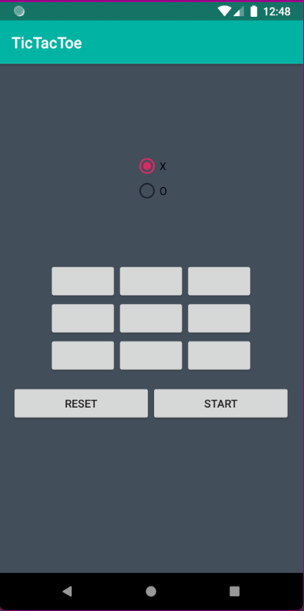
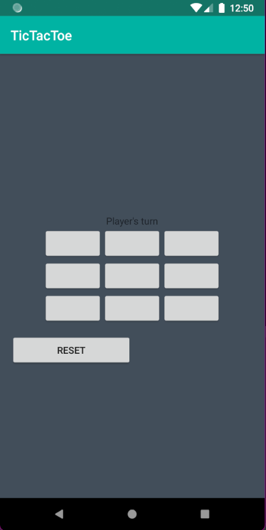
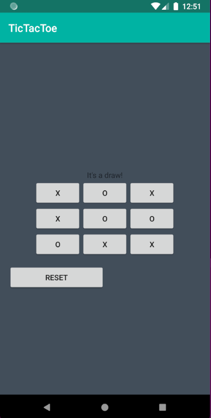

# Tic-Tac-Toe Game with Minimax Algorithm
This game allows you to play against an intelligent computer opponent that is difficult to compete with. You have the freedom to choose whether you want to play as "X" or "O".

## How to Play
1. Clone the repository to your local machine or download the source code files.
2. Compile and run the program using a suitable programming language and compiler. Make sure you have the necessary dependencies installed.
3. Once the game starts, you will be prompted to choose whether you want to play as "X" or "O". Simply enter your choice. The computer will automatically take the opposite symbol.
4. The game board consists of a 3x3 grid with empty cells represented by numbers 1 to 9.
5. Make your move.
6. The computer will then make its move based on the Minimax algorithm, attempting to make the best possible move to win or at least tie the game.
7. The game will continue until one player wins or the game ends in a draw.
8. At the end of the game, you will be shown the final result and given the option to play again or exit the game.

## MiniMax Algorithm
The Minimax algorithm is a decision-making algorithm commonly used in two-player games, such as Tic-Tac-Toe. It determines the best possible move for a player by recursively evaluating all possible moves and their outcomes. The algorithm assigns scores to each possible move and selects the move with the highest score for the maximizing player (in this case, the computer) and the move with the lowest score for the minimizing player (the human player).

By utilizing the Minimax algorithm, the computer opponent in this game will make intelligent and strategic moves, making it challenging for you to win.

## Dependencies
The game does not have any external dependencies. It is implemented using standard programming language libraries and functions.

## Screenshots
1. Choose whether you want to play as "X" or "O" then click on "Start" button to start the game.
   * 
2. The board will be available to start the game and make your first move.
   * 
3. At the end the result will be displayed.
   * 
4. To start again you can easily click on "Reset" button.

Enjoy playing Tic-Tac-Toe against the challenging computer opponent! Have fun and may the best player win!

